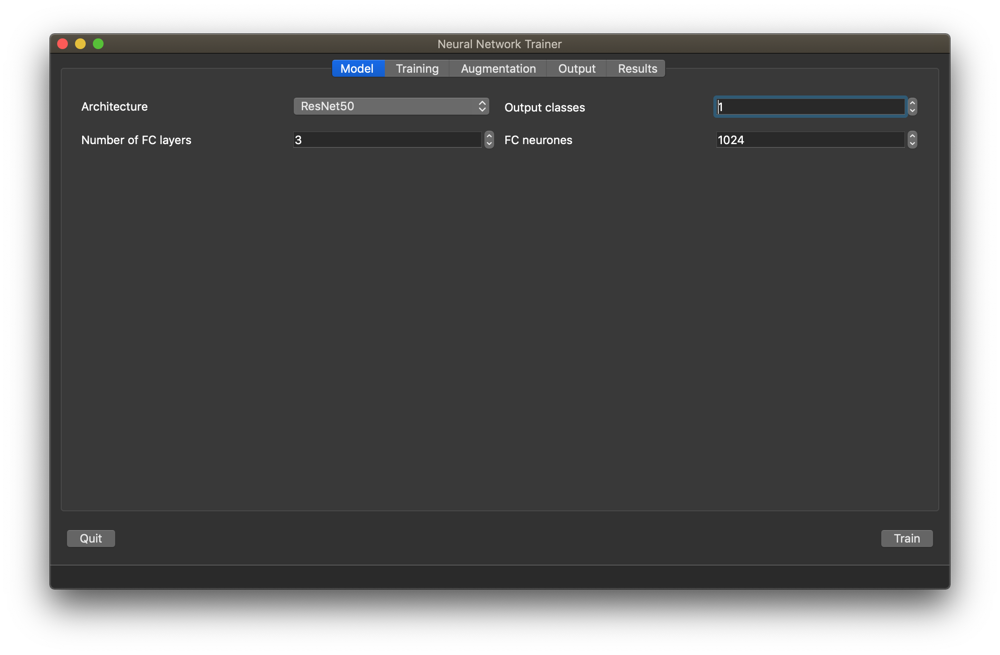
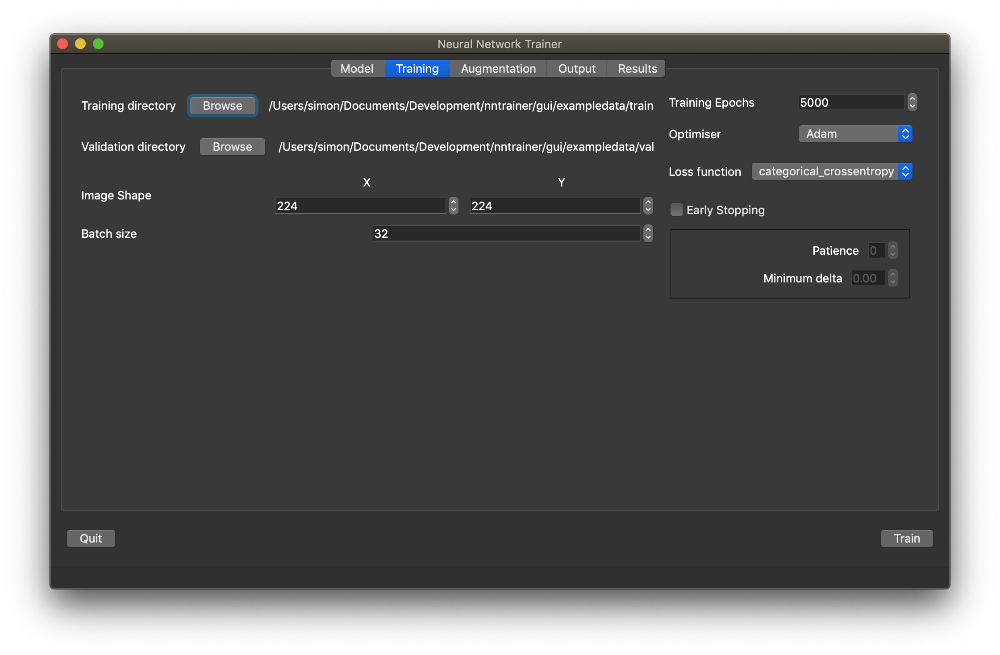
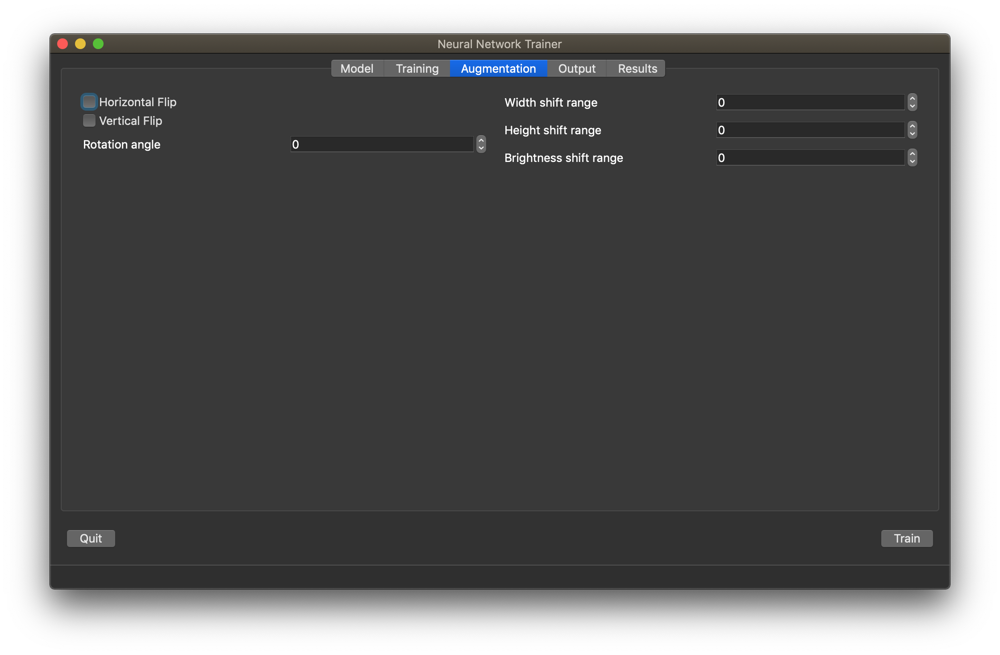

# Neural Network Trainer

Quickly and interactively train a neural network image classifier. Currently a PyQt5 GUI version has been developed.

## Key inputs required from the user

* network architecture (e.g. `VGG16`, `Resnet50`)
* number of output classes
* hyperparameters?
* training algorithm (`Adam`, `SGD`?)

## Implementation ideas

### Desktop GUI

Use PyQt to build a local GUI. This has the advantage of being runable from the local machine with the data on, however requires being run from the machine with the GPU (i.e. the same machine).

#### Screenshots

The model page lets the user configure the architecture to be used, the number of classes to predict, and the fully connected layers. All architectures are pre-trained on ImageNet.



The training page is for setting up the data locations, as well as the image dimensions, and training parameters.



Data augmentation can be configured with the augmentation page, including shifts, rotations and flips.



The output page configures where the results are stored, and the unique name. A training checkpoint file is stored under `{name}_checkpoints.h5`, and the tensorboard logs are stored under `{name}_tb`. 


**Results page**

Work in progress: will show the training graphs, live.

#### Installation

```git clone https://github.com/mindriot101/nntrainer
cd nntrainer/gui
pip install -e .
```

#### Running

After installation, run the code on the command line with `nntrainer`.

#### Packaging

*TODO*: use `pyinstaller` or similar to package up as an executable

### Web app

**abandoned**

This is hostable, so can be run on the GPU machine, however requires the data to be sent to the server somehow. Uploading a zip file is inconvenient, but may be the best approach.

This also allows the user to "submit a training job" and come back to it later, rather than leaving the GUI running.
